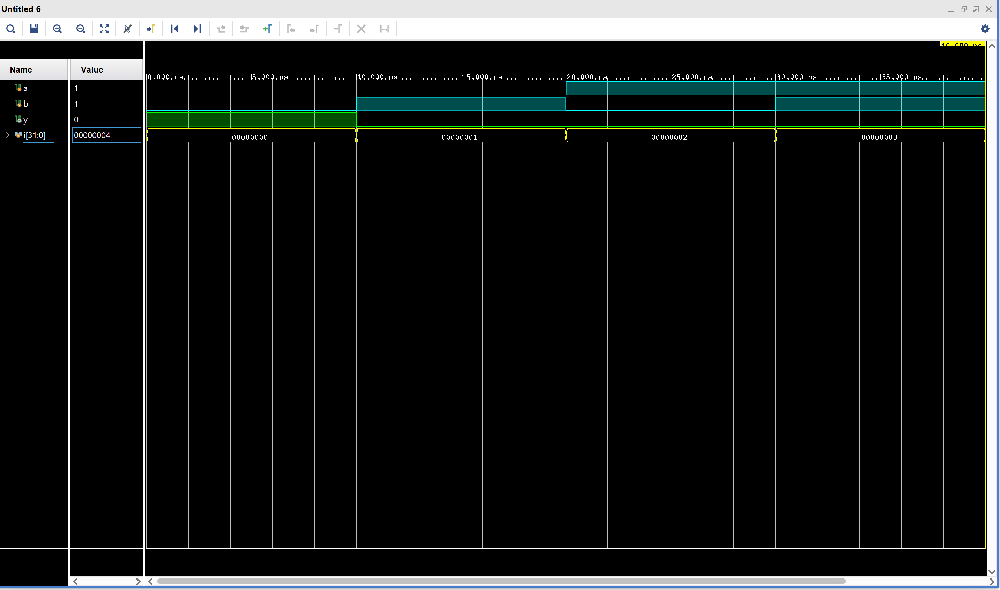

# NOR_gate

## Description
NOR gate is one of the two universal gates, meaning any basic logic gate can implemented using only NOR gates.

It is the complement of the OR gate, i.e., the output becomes 1 only when all the inputs are 0. In all other input combinations, the output remains 0.

In this project, the 2-input NOR gate is implemented in Verilog HDL using gate level modeling.

## Simulation

In the simulation waveform:

  - The blue signals (a, b) represent the inputs to the NOR gate.

  - The green signal (y) represents the output of the NOR gate.

  - The yellow signal (i) is the looping variable used inside the testbench to apply different input combinations to the NOR gate.

## Files
- NOR_gate.v
- NOR_gate_tb.v
