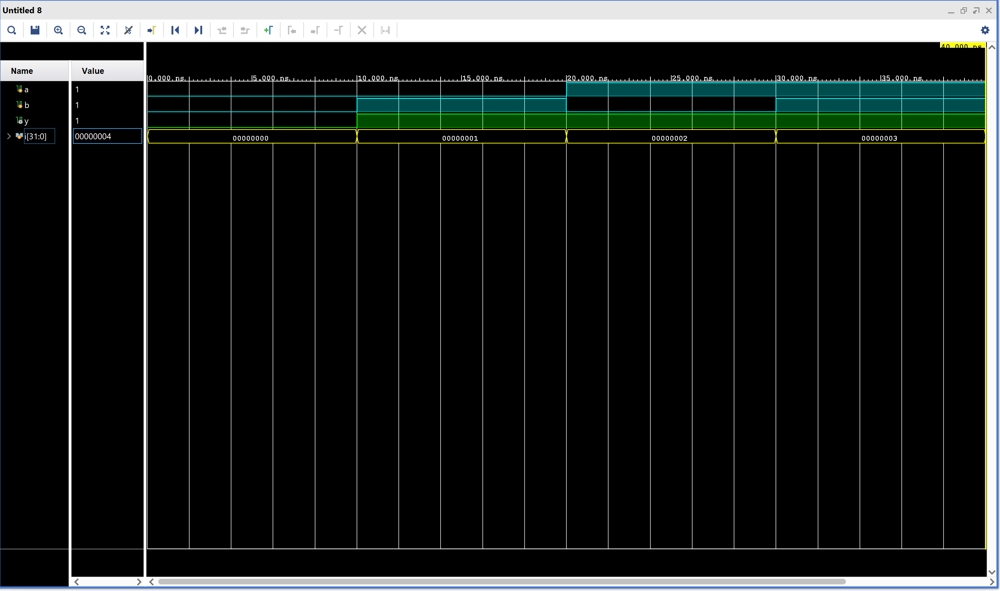

# OR_gate

## Description
OR gate is one of the basic gates used in digital logic design. It behaves as majority-1 gate as even if one of the input signal is 1 then the output is 1.

In this project, the 2-input OR gate is implemented in Verilog HDL using gate level modeling.

## Simulation

In the simulation waveform:

- The blue signals (a, b) represent the inputs to the OR gate.

- The green signal (y) represents the output of the OR gate.

- The yellow signal (i) is the looping variable used inside the testbench to apply different input combinations to the OR gate.

## Files
- OR_gate.v
- OR_gate_tb.v
