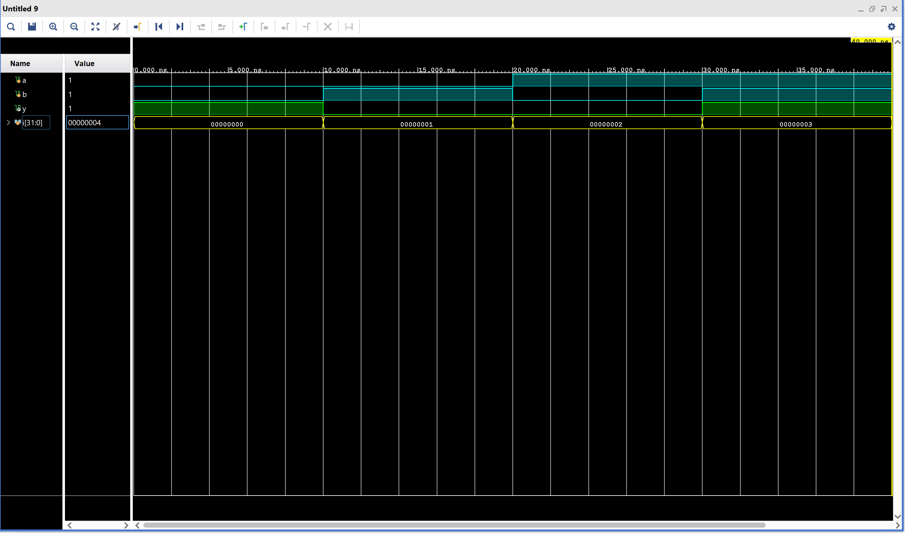

# XNOR_gate

## Description
The XNOR gate (Exclusive-NOR gate) is a fundamental digital logic gate and is the complement of the XOR gate. It outputs 1 when the number of 1s in the inputs is even.

In this project, the 2-input XNOR gate is implemented in Verilog HDL using gate level modeling.

## Simulation

In the simulation waveform:

- The blue signals (a, b) represent the inputs to the XNOR gate.

- The green signal (y) represents the output of the XNOR gate.

- The yellow signal (i) is the looping variable used inside the testbench to apply different input combinations to the XNOR gate.

## Files
- XNOR_gate.v
- XNOR_gate_tb.v
