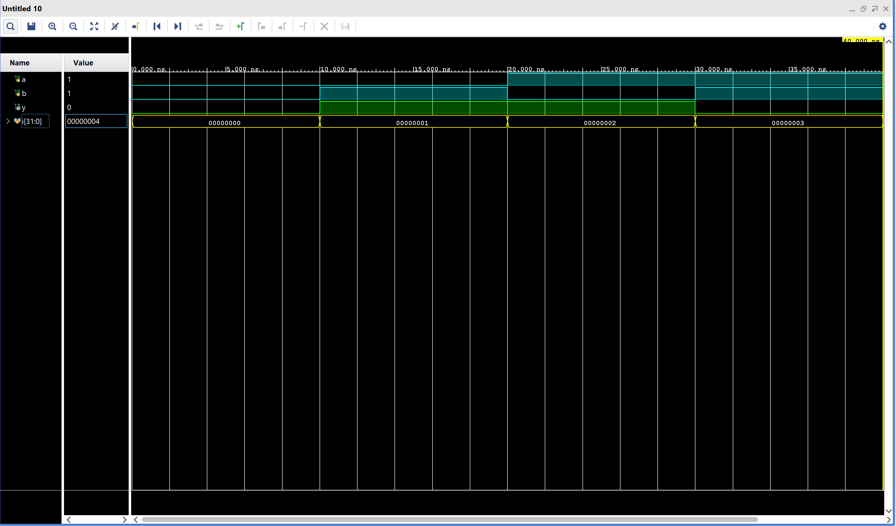

# XOR_gate

## Description
The XOR gate (Exclusive-OR gate) is a fundamental digital logic gate. It outputs 1 when the number of 1s in the inputs is odd.

In this project, the 2-input XOR gate is implemented in Verilog HDL using gate level modeling.

## Simulation

In the simulation waveform:

- The blue signals (a, b) represent the inputs to the XOR gate.

- The green signal (y) represents the output of the XOR gate.

- The yellow signal (i) is the looping variable used inside the testbench to apply different input combinations to the XOR gate.

## Files
- XOR_gate.v
- XOR_gate_tb.v
